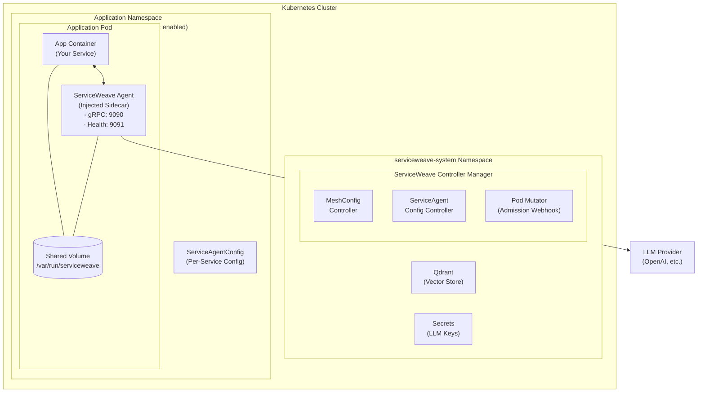
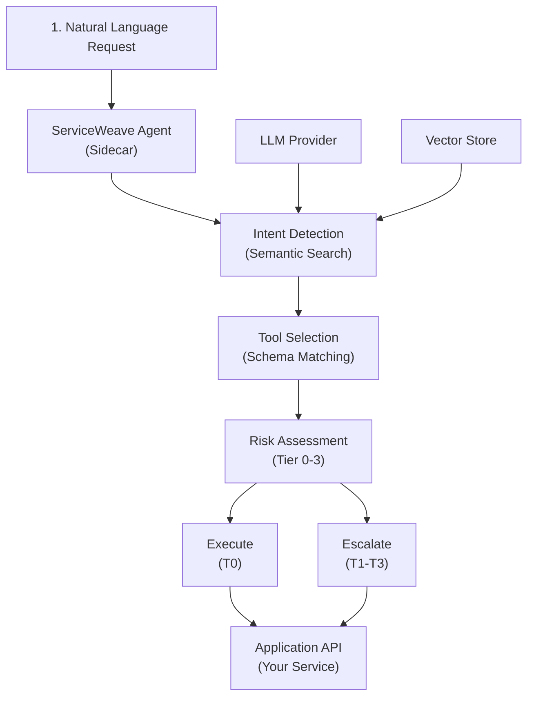
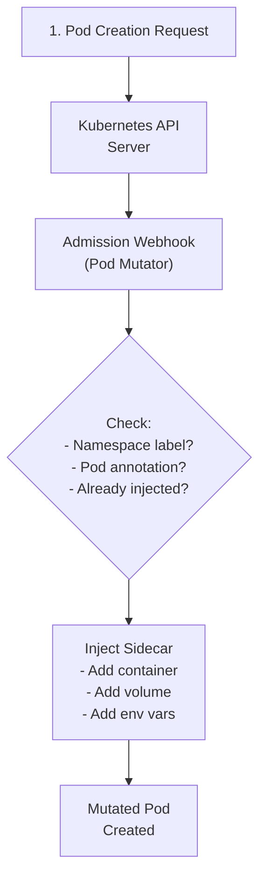

# Architecture

ServiceWeave implements a Kubernetes-native architecture using the operator pattern to manage AI-powered service agents across your cluster.

## System Overview



## Core Components

### 1. ServiceWeave Controller Manager

The controller manager is the brain of ServiceWeave. It runs as a Deployment in the `serviceweave-system` namespace and includes:

| Component | Responsibility |
|-----------|----------------|
| **MeshConfig Controller** | Manages global mesh configuration, validates secrets, tracks namespaces |
| **ServiceAgentConfig Controller** | Manages per-service configuration, validates service references |
| **Pod Mutator** | Mutating admission webhook that injects sidecars into pods |

### 2. Custom Resource Definitions (CRDs)

ServiceWeave defines two CRDs:

- **MeshConfig** (cluster-scoped): Global configuration for LLM, embedding, and vector store settings
- **ServiceAgentConfig** (namespaced): Per-service configuration for API schema discovery

### 3. ServiceWeave Agent Sidecar

The agent sidecar is automatically injected into pods in enabled namespaces. It:

- Listens on port 9090 (gRPC) for agent requests
- Exposes health endpoints on port 9091 (HTTP)
- Communicates with the LLM provider for natural language understanding
- Discovers and caches API schemas from the application container
- Routes requests to the appropriate API endpoints

## Data Flow

### Request Processing Flow



### Sidecar Injection Flow



## Reconciliation Loops

### MeshConfig Reconciliation

The MeshConfig controller runs a continuous reconciliation loop:

1. **Fetch** the MeshConfig singleton
2. **Validate** that referenced secrets exist
3. **Count** namespaces matching the injection selector
4. **Count** active (Ready) ServiceAgentConfigs
5. **Update** status with current state
6. **Requeue** after 5 minutes for periodic checks

### ServiceAgentConfig Reconciliation

The ServiceAgentConfig controller reconciles each config:

1. **Fetch** the ServiceAgentConfig
2. **Validate** target service exists (if specified)
3. **Validate** override secrets exist (if specified)
4. **Update** status with validation results
5. **Requeue** after 5 minutes for periodic checks

## Security Model

### RBAC Permissions

The operator uses minimal RBAC permissions:

| Resource | Permissions | Purpose |
|----------|-------------|---------|
| MeshConfig | Full CRUD | Manage global config |
| ServiceAgentConfig | Full CRUD | Manage per-service config |
| Secrets | Get, List, Watch | Read API credentials |
| Services | Get, List, Watch | Validate target services |
| Namespaces | Get, List, Watch | Check injection labels |
| Pods | Get, List, Watch | Webhook injection |

### Sidecar Security Context

Injected sidecars run with restrictive security settings:

```yaml
securityContext:
  runAsNonRoot: true
  readOnlyRootFilesystem: true
  allowPrivilegeEscalation: false
  capabilities:
    drop:
      - ALL
```

### Secret Management

- LLM API keys are stored as Kubernetes Secrets
- Global secrets must be in `serviceweave-system` namespace
- Per-service override secrets must be in the same namespace as the ServiceAgentConfig
- Secrets are passed to sidecars via environment variables

## High Availability

### Operator HA

- Single replica by default
- Can be scaled for HA with leader election
- Webhook has `failurePolicy: Ignore` to prevent blocking pod creation

### Agent HA

- Each pod gets its own agent sidecar
- Agents are stateless and can be restarted
- Session state can be persisted externally (future feature)

## Extensibility

ServiceWeave is designed for extensibility:

- **LLM Providers**: Any OpenAI-compatible API
- **Schema Types**: OpenAPI, GraphQL, gRPC
- **Vector Stores**: Qdrant (more planned)
- **Observability**: OpenTelemetry integration

## Next Steps

- [Agentic Mesh](agentic-mesh.md) - Understand the mesh concept
- [Sidecar Injection](sidecar-injection.md) - Deep dive into injection
- [MeshConfig Reference](../configuration/meshconfig.md) - Configuration options
